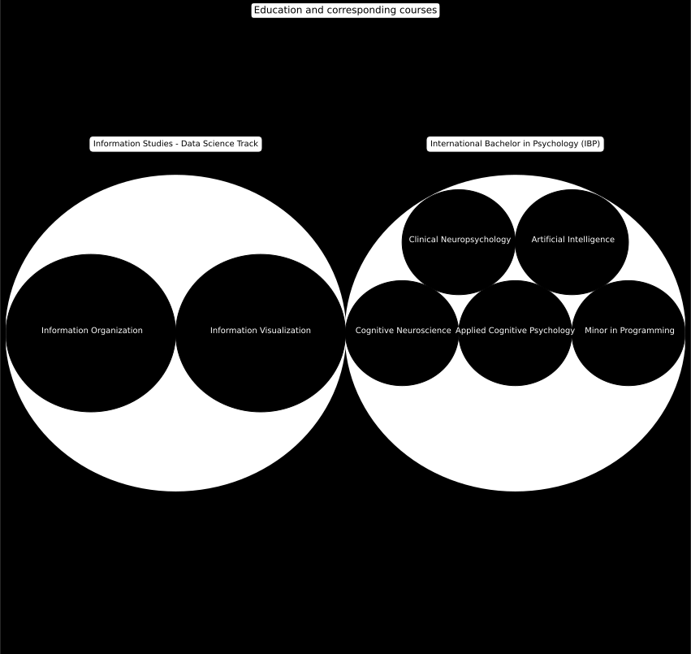

<h1>👤 Ruchella Kock</h1>
I am passionate about the intersection of neuroscience and machine learning. My work focuses on understanding how the brain processes real world behavior captured through (smart) devices. I primarily fulfill the role of a data scientist working with timeseries datasets.

27 Years Old

📧 test@test.com

🠠Koningweg 198, Amsterdam, 1928AK, South, Netherlands

📶 Follow me on:
<ul><li><strong>Github</strong>: <a href='https//github.com/rushkock' target='_blank'>https//github.com/rushkock</a></li><li><strong>LinkedIn</strong>: <a href='https//www.linkedin.com/in/ruchella-kock/' target='_blank'>https//www.linkedin.com/in/ruchella-kock/</a></li></ul><h1>🮠Interest(s) </h1><li>Triathlons</li><li>Reading:  I enjoy fantasy and sci-fi book as well as philosophy</li><li>Weight Lifting</li>
<h2>👤📊 Personal profile Visualized </h2><h1>📠Education</h1><h2 style='margin-bottom:5px;'>Bachelor</h2>
2016 - 2019

<strong>International Bachelor in Psychology (IBP)</strong>

Universiteit Leiden

GPA: 8.0

<strong>Specializations/Electives:</strong>
<ul><li>Applied Cognitive Psychology</li><li>Cognitive Neuroscience</li><li>Clinical Neuropsychology</li><li>Artificial Intelligence</li><li>Minor in Programming</li></ul>
<h2 style='margin-bottom:5px;'>Master</h2>
2019 - 2021

<strong>Information Studies - Data Science Track</strong>

Universiteit van Amsterdam

GPA: 7.95

<strong>Specializations/Electives:</strong>
<ul><li>Information Visualization</li><li>Information Organization</li></ul>
<h2>ğŸ“📊 Education Visualized </h2><h1>💼 Experience(s) </h1>
<h3 style='margin-bottom:5px;'>Full Stack Developer</h3>
Leiden University (Cognition in the Digital Environment Laboratory)

Nov 2019 – Jun 2021

Full-stack development of agestudy.nl

<h3 style='margin-bottom:5px;'>PhD Candidate</h3>
Leiden University (Cognition in digital environment)

Oct 2021 – Present

Analyzed EEG and behavioral data. Trained machine learning algorithms (LSTM

<h4>📃 Relevant Publications</h4>
<strong>Temporal clusters of age-related behavioral alterations captured in smartphone touchscreen interactions</strong> <em>enea ceolini, Ruchella Kock, guido ph band, gijsbert stoet, arko ghosh</em> Published in iScience DOI: <a href='https://doi.org/10.1016/j.isci.2022.104791' target='_blank'>10.1016/j.isci.2022.104791</a>

<strong>Neural processing of goal and non-goal-directed movements on the smartphone</strong> <em>Ruchella Kock, enea ceolini, lysanne groenewegen, arko ghosh</em> Published in NeuroImage: Reports DOI: <a href='https://doi.org/10.1016/j.ynirp.2023.100164' target='_blank'>10.1016/j.ynirp.2023.100164</a>

<strong>Neural microstates in real-world behaviour captured on the smartphone</strong> <em>Ruchella Kock, arko ghosh</em> Published in bioRxiv DOI: <a href='https://doi.org/10.1101/2024.07.22.604605' target='_blank'>10.1101/2024.07.22.604605</a>

<strong>Multiple forms of neural processing when repeating voluntary thumb flexions</strong> <em>Ruchella Kock, arko ghosh</em> Published in bioRxiv DOI: <a href='https://doi.org/10.1101/2023.02.19.529148' target='_blank'>10.1101/2023.02.19.529148</a>

<h3 style='margin-bottom:5px;'>Research Internship</h3>
Leiden University (Cognition in digital environment)

Jul 2020 – Jul 2021

Developed and trained a Long Short-Term Memory (LSTM) model for predicting sensor data. Integrated datasets from four sources for coherent analysis.

<strong>Related skills:</strong>
<ul><li>Deep Learning <em style='color: gray;'>(Hard-skill)</em></li><li>Data Alignment <em style='color: gray;'>(Hard-skill)</em></li></ul>

Associated study: International Bachelor in Psychology (IBP)

<h3 style='margin-bottom:5px;'>Data Visualization Internship</h3>
QuantActions A.G.

Nov 2020 – Feb 2021

Designed and implemented data visualizations for a smartphone-based health and behavior application making complex behavioral data easily interpretable.

<strong>Related skills:</strong>
<ul><li>Agile Thinking <em style='color: gray;'>(Hard-skill)</em></li><li>Data Visualization design <em style='color: gray;'>(Hard-skill)</em></li></ul>

Associated study: International Bachelor in Psychology (IBP)

<h3>Project: Violation of homogeneity of variances: A comparison between Welch’s t-test and the permutation test</h3>
Leiden University

Mar 2019 – Jul 2019

Bachelor thesis project on statistical tests for variance homogeneity.

<strong>Related skills:</strong>
<ul><li>Statistics <em style='color: gray;'>(Hard-skill)</em></li><li>Permutation Testing <em style='color: gray;'>(Hard-skill)</em></li><li>Simulations <em style='color: gray;'>(Hard-skill)</em></li></ul>

View Project <a href='http://rushkock-env.eba-yi6rkpue.us-east-1.elasticbeanstalk.com/thesis' target='_blank'>here</a>

<h3>Project: Pizza or Donuts: Food Image Classification with VGG16</h3>
Jun 2020 – Jun 2020

Classification of food images (Pizza or Donuts) using VGG16 architecture.

<strong>Related skills:</strong>
<ul><li>Computer Vision <em style='color: gray;'>(Hard-skill)</em></li><li>VGG16 <em style='color: gray;'>(Hard-skill)</em></li><li>Deep Learning <em style='color: gray;'>(Hard-skill)</em></li></ul>

View Project <a href='http://rushkock-env.eba-yi6rkpue.us-east-1.elasticbeanstalk.com/computer_vision' target='_blank'>here</a>

<h3>Project: Analysis of Movements Identified by Artificial Neural Network During Smartphone Use.</h3>
Universiteit van Amsterdam

Apr 2021 – Jul 2021

Master thesis analyzing smartphone-based movement patterns using artificial neural networks.

<strong>Related skills:</strong>
<ul><li>LSTM <em style='color: gray;'>(Hard-skill)</em></li></ul>

View Project <a href='https://scripties.uba.uva.nl/search?id=726200' target='_blank'>here</a>

<h2>💼📊 Experience(s) Visualized </h2>